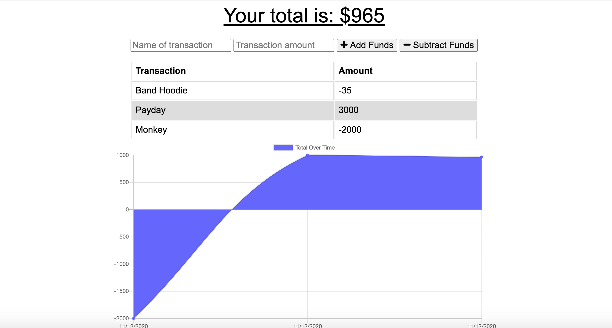
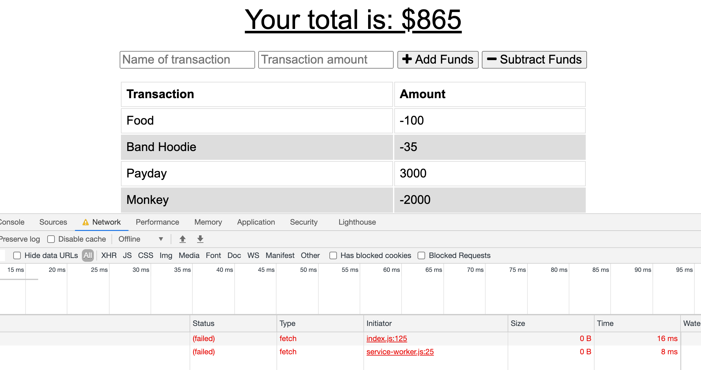
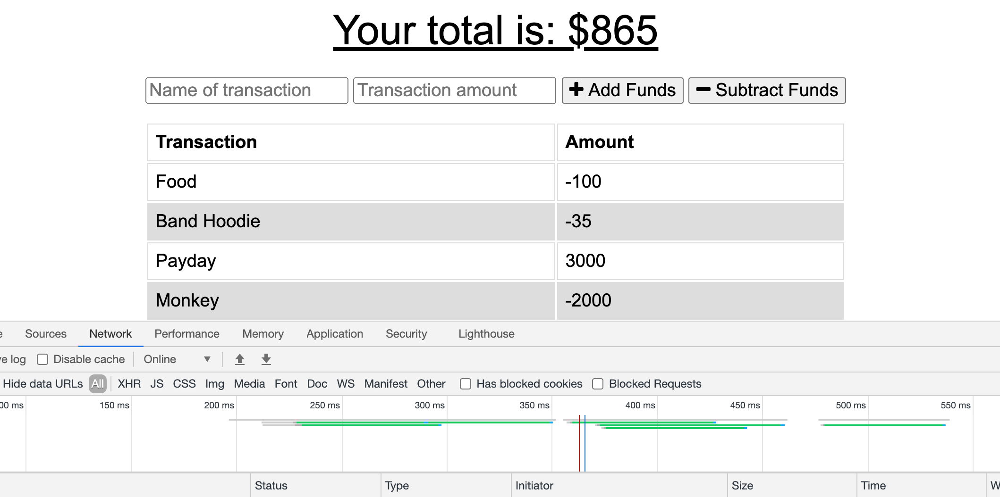

# 18-Budget-Trackers

## Live site:

Read Me:
https://github.com/theisen92/18-Budget-Trackers

Live Site:
https://warm-sea-16547.herokuapp.com/

## Usage

For someone who wants to track there budget who isn't always in a spot with a good connection to wi-fi or cellular

## Credits

I primarily used the information from class activities and MDN Developer for resources and referenced previous activities. 

## Contributing

I worked on with one of my classmates

## Challenges

The main challenge was getting the information to save to the indexedDB and also to upload the information after reconnected

## Functionality

Look of the site

Adding your deductions offline

Updating once back online

